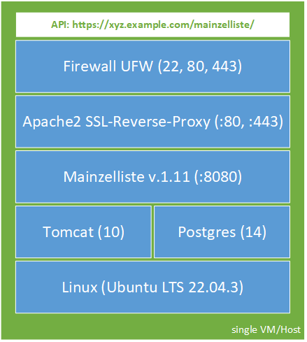

# Mainzelliste: manual installation and deployment basics
This README helps you installing Mainzelliste __manually__ on a Linux system (__without__ using the supplied __Docker__ environment), and provides some additional information and thoughts on possible deployment tasks need to be taken. The initial steps will take about 20 minutes, based on a running linux with SSH root access.

### Overview of the proposed solution in this manual:



### prerequisites
<details>
<summary>prerequisites/conditions/restrictions/assumptions of this manual:</summary>
  
+ Mainzelliste 1.11 (and later)
+ Ubuntu 22.04.3 LTS (comes with certain versions of Java, Tomcat, Apache, etc.) [End of Standard Support: June 2027]
+ Tomcat 10 (is required since Mainzelliste 1.11)
+ Postgres 14 (or other DB like MariaDB / MySQL etc.)
+ no usage of supplied Docker environment!
+ Apache2 as (local) reverse-proxy, in front of mainzelliste (for SSL transport encryption, and little URI beautification)
+ usage of free Let's encrypt SSL certificates (with certbot), therefore Mainzelliste-Host-Server needs to be accessible from the Internet (at least temporarily)
+ usage of UFW (ubuntu/uncomplicated firewall) [optional]
+ single-host-system: all services run on the same server/VM (Firewall, Apache as local SSL-Reverse-Proxy, Tomcat Aplication Server with Mainzelliste, Database)
+ you have to care about Updates (for Linux, Tomcat, Mainzelliste) and Database backups etc. on your own, or get help from your preferred sysadmin
+ you have a basic/solid knowledge of linux, ssh, bash, ports, html, APIs, usage of vim, etc., therefore the instructions and explanatory texts are kept short
+ you have root access to a bash shell, e.g. via ssh (or via 'su' environment if you like/prefere/forced to)
+ the instructions are chronological and in the form of step-by-step instructions (copy-paste), and should work seamlessly for Ubuntu 22 LTS default installation, with a working SSH-connection
</details>

### Updates to this document
<details>
<summary>Change history</summary>

| change date  | comment | contributor|
| ------------- | ------------- |-------------|
| 2023-12-01  | initial document, first version  |Juergen Riegel (jr)|
</details>

### Mainzelliste links:
* [Overview & Functions](https://www.unimedizin-mainz.de/imbei/medical-informatics/ag-verbundforschung/mainzelliste.html?L=1)
* [Download](https://bitbucket.org/medicalinformatics/mainzelliste)

### Other Mainzelliste documentation
<details>
<summary>Find more in depth documentation here</summary>
  
* API getting started:
  * https://bitbucket.org/medicalinformatics/mainzelliste/src/master/doc/getting-started.md
  * see 'API examples' at the end of this page, too
* Config, Developer, full API docs:
  * https://bitbucket.org/medicalinformatics/mainzelliste/downloads/
* Mainzelliste __with__ Docker:
  * https://bitbucket.org/medicalinformatics/mainzelliste/src/master/docker.md
* Mainzelliste changelog
  * https://bitbucket.org/medicalinformatics/mainzelliste/src/master/changelog.md
* 'Wiki' (external IDs, contributing to Mainzelliste, configuring SecuTrial)
  * https://bitbucket.org/medicalinformatics/mainzelliste/wiki/Home
* More docs
  * https://bitbucket.org/medicalinformatics/mainzelliste/wiki/2.%20Mainzelliste%20Documentation.md
</details>

---

## Linux Ubuntu 22.04 LTS
Fetch the latest updates for your linux. reboot (optional) if new kernel etc.
```Shell
apt-get update
apt-get upgrade -y
reboot
```

---

## Java
The preinstalled Java version of Ubuntu 22 is wrong/too old for Tomcat10/Mainzellliste 1.11, fetch a newer one.
```Shell
apt-get install openjdk-17-jdk -y
```

---

## Tomcat 10
The Tomcat version of Ubuntu 22 (available from repositories via apt) is too old for Mainzellliste 1.11, fetch (at least) Tomcat 10, which is required by Mainzelliste 1.11.

Create Folder, Download latest TAR from Tomcat, Unzip, set symbolic link to 'latest', add user for tomcat, set suitable user rights
```Shell
mkdir /opt/tomcat
cd /opt/tomcat
wget https://dlcdn.apache.org/tomcat/tomcat-10/v10.1.16/bin/apache-tomcat-10.1.16.tar.gz
tar xzf apache-tomcat-10.1.16.tar.gz
ln -s apache-tomcat-10.1.16 latest
useradd -m -U -d /opt/tomcat -s /bin/false tomcat
sh -c 'chmod +x /opt/tomcat/latest/bin/*.sh'
```

Delete all default/preinstalled Tomcat applications, create new ROOT with dummy homepage, create mainzelliste folder (optional), set rights
```Shell
cd /opt/tomcat/latest/webapps/
rm -Rf *
mkdir ROOT
cd ROOT
echo "mainzelliste tomcat" > index.html
mkdir /opt/tomcat/latest/webapps/mainzelliste
chown -R tomcat: /opt/tomcat
```

---

## Tomcat Service
To use Linux/Ubuntu service environment (start|stop|status), you need to create a new service for tomcat10

```Shell
vim /etc/systemd/system/tomcat10.service
```
*brief digression:* __vim__ 101 (just in case)
```Shell
:wq    #save and exit
:q!    #exit without saving
dd     #delete line
i      #insert, edit line
[Esc]  #leave current mode  
```

Put following content to `/etc/systemd/system/tomcat10.service`
```Shell
[Unit]
Description=Tomcat10
After=network.target
[Service]
Type=forking
User=tomcat
Group=tomcat
ExecStart=/opt/tomcat/latest/bin/startup.sh
ExecStop=/opt/tomcat/latest/bin/shutdown.sh
Environment="JAVA_HOME=/usr/lib/jvm/java-17-openjdk-amd64"
Environment="JAVA_OPTS=-Djava.security.egd=file:///dev/urandom -Djava.awt.headless=true"
Environment="CATALINA_BASE=/opt/tomcat/latest"
Environment="CATALINA_HOME=/opt/tomcat/latest"
Environment="CATALINA_PID=/opt/tomcat/latest/temp/tomcat.pid"
Environment="CATALINA_OPTS=-Xms512M -Xmx1024M -server -XX:+UseParallelGC"
[Install]
WantedBy=multi-user.target
```

Reload and enable new service
```Shell
systemctl daemon-reload
systemctl enable --now tomcat10
systemctl status tomcat10
```

---

## Postgres (14) Database

Install postgres database, su to postgres user, use psql to interact with database:
```Shell
apt install postgresql -y
su postgres
psql
```

Enter the folloging (SQL) commands to psql client (choose your own secure password here):
```SQL
CREATE USER mainzelliste WITH PASSWORD 'mainzelliste' CREATEDB;
CREATE DATABASE mainzelliste OWNER mainzelliste;
\l
\q
exit
```

This creates an empty 'mainzelliste' database. The mainzelliste will create the correct structures on first startup itself (if the DB is empty)!

---

## Mainzelliste

Now install the mainzelliste. We will check it out from GIT/bitbucket repository. We then will need the Java Maven tool, to compose and compile the WAR file for Tomcat.
```Shell
apt install git -y
cd /opt
git clone https://bitbucket.org/medicalinformatics/mainzelliste.git
cd /opt/mainzelliste
apt install maven -y
```

Now build/compile the WAR file (this will take a minute at first time, and produces a lot of output, check for critical errors!)
```Shell
mvn clean install
```

You find the WAR File for Tomcat (after a successful build) here: `/opt/mainzelliste/target/mainzelliste.war`

---

## Firewall

You should secure your server with a firewall. Here we use local linux firewall with `ufw` interface. `ufw` should be there by default.

```Shell
ufw status
ufw allow ssh
ufw allow https
ufw allow http
ufw enable
```

__Hint__: you will need to open http/80, to get SSL certificate, first time, and on renewal!

__Hint__: you can/should limit ssh, https, http even more, already here! (tcp only, IPv4 only, certain admin IPs for SSH, certain idat-origin servers for API access, etc. __although__ the mainzelliste API has further sophisticated and granular authorisation and authentication mechanisms for the API access itself, but 'twice' (or even more layers of security) is better!)

For testing only, you can open 8080/tomcat:
```Shell
ufw allow 8080
```

__Hint__: a direct access to tomcat (port 8080) from the outside world / internet, is not needed in production, when using Apache2 as local SSL-Reverse-Proxy (as presented in this solution/manual here)!

---

## Apache2

### Webserver

Install apache2 (webserver) as a local reverse proxy for https/443/SSL in 'front of' the tomcat application server. This improves security, adds a SSL transport encryption to this sensitive IDAT communication, and simplifies the URL-scheme (no trailing :8080 for the default Tomcat port etc.) when talking to the Mainzelliste API.

```Shell
apt-get install apache2 -y
cd /var/www/html
rm index.html
echo "mainzelliste http" > index.html
```

Install certbot (a tool to fetch a free SSL certificate from Let's encrypt):
```Shell
apt-get install certbot python3-certbot-apache -y
```

Edit the Apache config:
```Shell
vim /etc/apache2/sites-available/000-default.conf
```

Add this line to the Virtualhost:80 config section:
```Shell
ServerName www.example.com
# of course with your FQDN!
```

Config and fetch a free SSL certificate from Let's encrypt:
```Shell
certbot --apache
```
(accept eMail for expiring certificates, Terms, Newsletter?, choose domain)

__Hint__: at this point, your server/vm needs to be publicly accessible from the internet, on port 80 and 443 (at least temporarily)

Apache is now available by https under your FQDN through `https://www.example.com/` (but still not pointing to your mainzelliste)

### Reverse-Proxy

Activate the proxy mods for apache2:
```Shell
a2enmod proxy proxy_http proxy_balancer lbmethod_byrequests
```

Lets redirect the apache-https/443 traffic to the tomcat/8080 port:
```Shell
vim /etc/apache2/sites-available/000-default-le-ssl.conf
```

Add the following lines:
```Shell
ProxyRequests Off
ProxyPreserveHost On
ProxyPass / http://localhost:8080/
ProxyPassReverse / http://localhost:8080/
```

Restart apache2 to take effect:
```Shell
service apache2 restart
```

Next we need to tell __tomcat__ to use the https scheme, to produce correct response-URIs for the API-calls:
```Shell
vim /opt/tomcat/latest/conf/server.xml
```

at the block
```XML
<Connector port="8080" protocol="HTTP/1.1"
  .....
/>
```

add this additional line:
```Shell
scheme="https"
```

Finally restart tomcat:
```Shell
service tomcat10 restart
```

---

## Deployment of WAR file

As a little workaround, we have to do some additional steps, to be able to successfully deploy the mainzelliste-WAR file.

```Shell
mkdir /logs
chown -R tomcat: /logs
```

Now you can create your Mainzelliste configuration (but don't change name and location of `/etc/mainzelliste/mainzelliste.conf`):
```Shell
mkdir /etc/mainzelliste/
cp /opt/mainzelliste/config/mainzelliste.conf.default /etc/mainzelliste/mainzelliste.conf
vim /etc/mainzelliste/mainzelliste.conf
```

Initially, you need to do the following changes to `/etc/mainzelliste/mainzelliste.conf`
```Shell
# Uncomment this for PostgreSQL
db.driver = org.postgresql.Driver
db.url = jdbc:postgresql://localhost:5432/mainzelliste

# if you choose different DB passwort, change it in config too!
db.username = mainzelliste
db.password = mainzelliste

# Set a (long and secure) API Key for later!
servers.0.apiKey = jondoe23

# config logfile, uncomment, e.g.:
log.filename = /opt/tomcat/latest/logs/mainzelliste.log
```

Now we can deploy the mainzelliste WAR file, even if the tomcat-server is currently running:
```Shell
cp /opt/mainzelliste/target/mainzelliste.war /opt/tomcat/latest/webapps/ 
```

All necessary files and folders of the mainzelliste-Application will be unzipped/deployed/generated from the WAR file to `mainzelliste/` inside tomcat.

If all went ok, your mainzelliste is now running under: `https://www.example.com/mainzelliste/`

Showing something like: `This is Mainzelliste running version 1.11.0 for Mainzelliste.`

__Congratulations, you successfully deployed mainzelliste manually on your system!__ :sweat_smile: :unicorn:

---

# More ...

In this section you find a collection of short tips & code snippets.

## Quick API-Test

A session ID should be returned as a successful result, for this quick test:
```Shell
apt install curl
curl -X POST -i https://www.example.com/mainzelliste/sessions -H 'mainzellisteApiKey: jondoe23'
```

---


## close firewall ports

close Firewall ports, if you opend some for testing (close 8080, only open HTTPS/443, HTTP/80 (SSL certificat renewal!) and SSH if needed! Limit IP-Range for SSH if possible/suitable in your setup!)

```Shell
ufw status numbered
ufw delete {rule-number-here}
```

Further information: https://manpages.ubuntu.com/manpages/jammy/en/man8/ufw.8.html

---

## Logfiles

Mainzelliste Logfile:
```Shell
tail -f /opt/tomcat/latest/logs/mainzelliste.log
```

Tomcat Logfile:
```Shell
tail -f /opt/tomcat/latest/logs/catalina.out
```

apache2 Logfile
```Shell
tail -f /var/log/apache2/access.log
tail -f /var/log/apache2/error.log
```

postgres Lofile
```Shell
tail -f /var/log/postgresql/postgresql-14-main.log
```

---

## Links, URIs, URLs

__API__
```Shell
https://www.example.com/mainzelliste/
```

__Hint:__ if you use Apache2 as reverse proxy, and you open this URL in your web browser, you need the trailing slash, to work!

__iDAT-Admin-GUI__
```Shell
https://www.example.com/mainzelliste/html/admin/editPatient
```

You have to set a user/passwort in tomcat-config, in order to access the GUI.

You need to login with your admin password. Then you will be prompted to enter a existing pseudonym to be edited.

__Hint:__ See section "Enable iDAT-Admin-GUI" below.

__User-GUI (enter iDAT manually through Web-Form)__
```Shell
https://www.example.com/mainzelliste/html/createPatient?tokenId=479a69ac-6abd-4aa9-97a4-4a9b2cca8548
```

First, you need to create a session with the API. Inside of this session, you need to create an action-token (e.g. create). With this action-token, you can then access the User-GUI once

__Hint:__ see API examples below

---

## Enable iDAT-Admin-GUI for Mainzelliste

Edit tomcat config: `vim /opt/tomcat/latest/conf/tomcat-users.xml`

```XML
<tomcat-users ...
...
  <role rolename="admin" />
  <user username="admin" password="Secure#007" roles="admin"/>
</tomcat-users>
```

Restart tomcat: `service tomcat10 restart`

iDAT-Admin-GUI: `https://www.example.com/mainzelliste/html/admin/editPatient`

---

## Change of User-GUI

### CSS, Forms

You can change the look and the content of the GUIs (colors, more/less input-fields)

```Shell
/opt/tomcat/latest/webapps/mainzelliste/static/css/patientenliste.css
/opt/tomcat/latest/webapps/mainzelliste/WEB-INF/jsp
  # addPatient.jsp, footer.jsp, header.jsp etc.
```

### Language Settings (Messages, Errors, Language)

Mainzelliste evaluates the language, set in the web browser, and automatically shows german or english GUI language. 

all texts, field names and error messages displayed in the GUI are stored in a language file (e.g. MessageBundle_de.properties), you find them here:

```Shell
/opt/tomcat/latest/webapps/mainzelliste/WEB-INF/classes/MessageBundle_de.properties
/opt/tomcat/latest/webapps/mainzelliste/WEB-INF/classes/MessageBundle_en.properties
```

To set a fixed language for Mainzelliste, please edit `/etc/mainzelliste/mainzelliste.conf`

```Shell
# Set a fixed language for the user interface. Must be a language code for which a
# MessageBundle exists in the application. Current valid values are "en" and "de"
# language =
```

---

## Database tasks

### Database backups (with running DB)
```Shell
service tomcat10 stop
su postgres
pg_dump mainzelliste > mainzelliste.sql
service tomcat10 start
```

### Database restore
```Shell
service tomcat10 stop
su postgres
psql

  DROP DATABASE mainzelliste;
  CREATE DATABASE mainzelliste;
  \q

psql mainzelliste < mainzelliste.sql
service tomcat10 start
```

### Database data-Folder

```Shell
su postgres
psql
SHOW data_directory;
```

gives you information like:
```Shell
psql (14.9 (Ubuntu 14.9-0ubuntu0.22.04.1))
/var/lib/postgresql/14/main
```

---

## Software-Updates

You should check for software-updates on a regular basis:

### Tomcat, install new version

```Shell
service tomcat10 stop
cd /opt/tomcat
wget https://dlcdn.apache.org/tomcat/tomcat-10/v10.1.16/bin/apache-tomcat-10.1.16.tar.gz
tar xzf apache-tomcat-10.1.16.tar.gz
ln -s apache-tomcat-10.1.16.tar.gz latest

# copy webapps/ to new location (if you changed something on CSS, MessageBundle, JSPs, Forms etc.)
# check your server.xml (SSL, scheme="https") etc.
# copy conf/tomcat-users.xml to new location (if you set a password for IDAT-Admin GUI)
# or, if all is stock, redeploy war from Maven target e.g. with cp mainzelliste.WAR ...
# delete all default/preinstalled Tomcat applications, etc.

service tomcat10 start
```

__Hint:__ (only) for minor updates, replace the files in /opt/tomcat/apache-tomcat-10.x.yy/lib/ with files from new folder /opt/tomcat/apache-tomcat-10.x.zz/lib/ (handle with care!, make backup and dont touch old tomcat folder, set a new symbolic link for 'latest', to be able to switch back easily!)

### Mainzelliste, install new version

```Shell
service tomcat10 stop
cd /opt/
git clone https://bitbucket.org/medicalinformatics/mainzelliste.git
cd mainzelliste
mvn clean install
# backup your old WAR, just in case
# cp /opt/tomcat/latest/webapps/mainzelliste.war /tmp
cp /opt/mainzelliste/target/mainzelliste.war /opt/tomcat/latest/webapps/
service tomcat10 start
```

---

## Automatisms & Cron-Jobs

You should introduce some automatisms for your server.

### Linux packages

Activate the auto-update of your linux packages (not includes tomcat and mainzelliste!)
```Shell
apt install unattended-upgrades
systemctl status unattended-upgrades
apt install update-notifier-common
```

if you want auto-reboots on certain updates: `vim /etc/apt/apt.conf.d/50unattended-upgrades`
```Shell
// Unattended-Upgrade::Automatic-Reboot-WithUsers "true";
// Unattended-Upgrade::Automatic-Reboot-Time "04:00";
```

Run TUI to enable the auto-upgrades:
```Shell
dpkg-reconfigure --priority=low unattended-upgrades
# also creates:
#/etc/apt/apt.conf.d/20auto-upgrades
```

---

## Database
Dump Database to backup daily at night etc.

```Shell
#service tomcat10 stop
su postgres
pg_dump mainzelliste > mainzelliste.sql
#service tomcat10 start

# install cronjob, create a little script
# crontab -e
```

---

## Certbot

renew SSL, create a cronjob

`certbot renew --dry-run`

---

## Reverse-Proxy exceptions

Make proxy exceptions, to use local Apache as a webserver also (Content, Skripts, Forms, Keycloak, etc.)

Create content folder on apache:
```Shell
mkdir /var/www/html/test
cd /var/www/html/test
echo "proxy exception" > index.html
```

Edit the apache config: `vim /etc/apache2/sites-available/000-default-le-ssl.conf`
```Shell
# insert before rule "ProxyPass / http://localhost:8080/"
ProxyPass /test/ !
```

`service apache2 restart`

Open browser (need last trailing slash!): `https://www.example.com/test/`

The folder `/test/` is now being served by Apache directly, and is not being passed on/proxied to Tomcat/Mainzelliste, but is still SSL secured.

---

## hardware requirements

__RAM:__ it is mainly the number of people you have in the Mainzelliste index, that determines the main memory consumption

__CPU:__ mainly mainzelliste/tomcat and database will occupy your CPU cores.

Observe CPU and memory consumption with `htop` etc. See 'Show memory consumption of Tomcat' below.

### rough rule of thumb / experience values:

* small index (up to 1000 person index): 8gb of RAM, 2 CPU cores
* huge index  (1.5 million person index): 64gb of RAM

---

## RAM/memory limit for java/tomcat, running the mainzelliste application

Set the java heap, which defines the amount of memory that is available for tomcat/mainzelliste:

```Shell
vim /etc/systemd/system/tomcat10.service
CATALINA_OPTS=-Xms512M -Xmx1024M
```

__Xmx__ sets the __maximum__ of the memory allocation pool for your Java Virtual Machine (JVM) / Tomcat / Mainzelliste.

__Xms__ is the initial/minimum/start value.

---

## Show memory consumption of Tomcat

Bash skript/command, showing estimation of current memory consumption of tomcat process (for minimal monitoring)

```Shell
#!/bin/bash
ps -ax --no-headers --format=pid,rss,command --sort=-rss,pid | head -1 | awk 'BEGIN{suffixes_len=split("kB MB GB TB",suffixes)} {n_suffix=1; while($2 > 1000 && n_suffix < suffixes_len) {$2 /= 1024; n_suffix++;}; printf "%5s %7.2f %2s %s\n",$1,$2,suffixes[n_suffix],substr($0, index($0,$3))}' | grep tomcat | awk '{print $2 " " $3}'
```

---

## API examples

### Bash script to create session/token/URL, to add a patient (manual data input with Browser-GUI):
```Shell
#!/bin/bash

URL='https://xyz.example.com/mainzelliste'
API='jondoe23'

SESSIONID=$(curl -v --silent -X POST -i $URL"/sessions" -H 'mainzellisteApiKey: '$API 2>&1 | grep sessionId | awk -F '"' '{print $4}')
TOKEN=$(curl -v --silent -X POST -i $URL"/sessions/$SESSIONID/tokens" -d '{ type: "addPatient", data: {} }' -H 'mainzellisteApiVersion: 3.1' -H 'Content-Type: application/json' -H 'mainzellisteApiKey: '$API 2>&1 | grep addPatient | awk -F '"' '{print $4}')
GUIURL=$URL"/html/createPatient?tokenId="$TOKEN

echo "SessionId: " $SESSIONID
echo "Token:     " $TOKEN
echo "GUI-URL:   " $GUIURL
```

### Bash script to create session/token/addPatient, to add a patient by API
```Shell
#!/bin/bash

URL='https://xyz.example.com/mainzelliste'
API='jondoe23'

VORNAME='Toni'
NAME='Test'
GEBURTSTAG='15'
GEBURTSMONAT='02'
GEBURTSJAHR='2021'

SESSIONID=$(curl -v --silent -X POST -i $URL"/sessions" -H 'mainzellisteApiKey: '$API 2>&1 | grep sessionId | awk -F '"' '{print $4}')
TOKEN=$(curl -v --silent -X POST -i $URL"/sessions/$SESSIONID/tokens" -d '{ type: "addPatient", data: { "idtypes": ["pid"], fields: { "vorname": "'$VORNAME'", "nachname": "'$NAME'", "geburtstag": "'$GEBURTSTAG'","geburtsmonat": "'$GEBURTSMONAT'","geburtsjahr": "'$GEBURTSJAHR'" } }}' -H 'mainzellisteApiVersion: 3.1' -H 'Content-Type: application/json' -H 'mainzellisteApiKey: '$API 2>&1 | grep addPatient | awk -F '"' '{print $4}')
PID=$(curl -v --silent -X POST -i $URL"/patients?tokenId="$TOKEN -d '{ type: "addPatient", data: {}, "sureness": "true" } ' -H 'mainzellisteApiVersion: 3.1' -H 'Content-Type: application/json' -H 'mainzellisteApiKey: '$API 2>&1 | grep pid | awk -F '"' '{print $8}' )

echo ""
echo "SessionId: " $SESSIONID
echo "Token:     " $TOKEN
echo "PID:       " $PID
echo ""
```

### Example: create pseudonyms, only based on reference-ID

This example describes the case, when you only have a reference-ID (let's say, a primary-pseudonym, person-ID, external ID, from other lists or software-systems). In this case, you can't do the record linkage on name, firstname, date of birth, etc. to create a pseudonym.

```Shell
# change the existing config, used in this docs, see above
# vim /etc/mainzelliste/mainzelliste.conf

# e.g. we want 2 pseudonyms, for a given foreign/external ID (fid)
idgenerators = psn1, psn2, fid

#  ElasticIDGenerator is used for randomly generated id types with the flexible length and vocabulary
# the pre-defined vocabulary has no 1, 0, I, L, O, e.g. to to avoid confusion in pseudonym strings
idgenerator.psn1 = ElasticIDGenerator
idgenerator.psn1.vocabulary = 23456789ACDEFGHJKMNPQURTUVWXYZ
idgenerator.psn1.length = 10

idgenerator.psn2 = ElasticIDGenerator
idgenerator.psn2.vocabulary = 23456789ACDEFGHJKMNPQURTUVWXYZ
idgenerator.psn2.length = 10

# for the external / foreign ID, add this line
idgenerator.fid = ExternalIDGenerator
```

Restart tomcat: `service tomcat10 restart`

__Hint__: if you are testing, and you already have some old entries in the postgres DB, and you changed some major things like primary pseudonym configuration, it's a good advice to clear the database, before you proceed ... see section "Database restore" for more (stop tomcat, DROP db, CREATE db, start tomcat, to get fresh/empty db)


Now we can talk to the API with the following BASH script, to aquire some pseudonyms, for the given "fid" (foreign/external ID) "21234343453453454":
```Shell
#!/bin/bash

URL='https://xyz.example.com/mainzelliste'
API='jondoe23'

SESSIONID=$(curl --insecure -v --silent -X POST -i $URL"/sessions" -H 'mainzellisteApiKey: '$API 2>&1 | grep sessionId | awk -F '"' '{print $4}')
TOKEN=$(curl --insecure --silent -X POST -i $URL"/sessions/$SESSIONID/tokens" -d '{"type": "addPatient", "data": {"idtypes": ["psn1", "psn2"]}}' -H 'mainzellisteApiVersion: 3.1' -H 'Content-Type: application/json' -H 'mainzellisteApiKey: '$API 2>&1 | grep addPatient | awk -F '"' '{print $4}')
PID=$(curl --insecure --silent -X POST -i $URL"/patients?tokenId="$TOKEN -d '{ "ids" : {"fid": "21234343453453454"} }' -H 'mainzellisteApiVersion: 3.1' -H 'Content-Type: application/json' -H 'mainzellisteApiKey: '$API 2>&1 )

echo ""
echo "SessionId: " $SESSIONID
echo "Token:     " $TOKEN
echo "PID:       " $PID
echo ""
```

As a result, we get something like this:
```Shell
SessionId:  0f04d49e-81df-4987-8e9e-bfb1b060b5ed
Token:      58c25ba9-8a97-4a90-8eb3-ee33b4fce6dc

 [
{"idType":"psn1","idString":"psn1XFNJEFH448","tentative":false,"uri":"https:\/\/xyz.example.com\/mainzelliste\/patients\/psn1\/psn1XFNJEFH448"},
{"idType":"psn2","idString":"psn2UQCQVZTG79","tentative":false,"uri":"https:\/\/xyz.example.com\/mainzelliste\/patients\/psn2\/psn2UQCQVZTG79"},
{"idType":"fid","idString":"21234343453453454","tentative":false,"uri":"https:\/\/xyz.example.com\/mainzelliste\/patients\/fid\/21234343453453454"}
]
```


### More examples
Find some __more examples__ here:

* https://bitbucket.org/medicalinformatics/mainzelliste/src/master/doc/getting-started.md
* https://bitbucket.org/medicalinformatics/mainzelliste/downloads/

.
